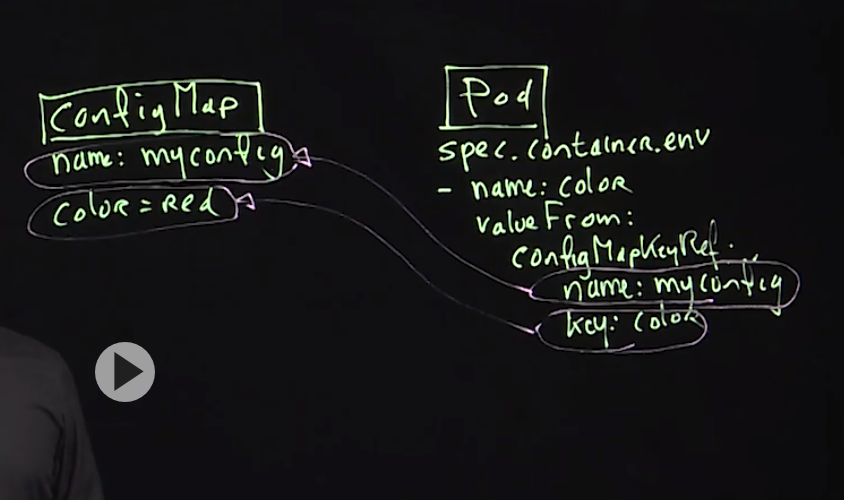

# Kubernetes

## Module 1: Getting Started

### 1.1 Understanding Kubernetes Core Functions
* It is composed for replica, deployment, pod, container, api, etc resources

### 1.2 Understanding Kubernetes API Objects

```bash
# Everything running on the kube-system namespace
kubectl get pods -n kube-system
```

```bash
# Everything is define in the API 
kubectl api-resources | less
```

```bash
kubectl api-versions
```

### 1.3 Understanding Kubernetes Architecture

#### Understanding the Master Node
* kube-apiserver: front-end of the cluster that services REST operations and connects to the etcd database
* kube-scheduler: schedules Pods on specific nodes based on labels, taints, and tolerations set of the Pods
* etcd: a B+tree key-value store that keeps the current cluster state
* kube-controller-manager: interacts with outside cloud managers
* Different optional add-ons
  * DNS
  * Dashboard
  * Cluster level resource monitoring
  * Cluster level logging

#### Understanding the Worker Nodes
* kubelet: passes requests to the container engine to ensure that Pods are available
* kube-proxy: runs on every node and uses iptables to provide an interface to connect to kubernetes components
* container runtime: takes care of actually running the containers
* supervisord: monitors and guarantees the availability of the kubelet and docker processses
* network agent: implements a software defined networking solution, such as weave
* logging: the CNCF project Fluentd is used for unified logging in the cluster. A Fluentd agent must be install on the k8s nodes

### 2.2 Using kubernetes in Public Cloud
* AWS
* Google Cloud
* Digital Ocean

### 2.3 Using minikube
* Good for learning

### 3.1 Understanding Cluster Node Requirements
* For reference, use https://kubernetes.io/docs/setup/production-environment/tools/kubeadm/create-cluster-kubeadm/
* To set up a kubernetes on-premise cluster, **kubeadm** is used
* You'll need a mimimum of one node, for the setup used in this course you'll need 3 nodes
* Use Centos 7.x or Ubuntu for best support
* The control node needs 2 CPUs
* All nodes need 1GiB a test environment, a minimum of 2GiB or (much) more is required for production environments
* Install without using swap space
  * **free -m**
  * **vim /etc/fstab**
  * look up for the swap line and comment it.
* Disable the firewall

#### Course Cluster Specs
* control.example.com
  * 2 CPUs
  * 2 GiB RAM
  * 192.168.100.210/24
* worker1.example.com
  * 1 GiB RAM
  * 192.168.100.211/24
* worker2.example.com
  * 1 GiB RAM
  * 192.168.100.212/24
* worker3.example.com
  * 1 GiB RAM
  * 192.168.100.213/24
* All using CentOS 7.x with a minimal installation pattern

#### Software Installation
* Before starting installation, you need a container runtime
* Different runtimes are supported, in this course we'll use **docker**
* To make installation easy, use **git clone https://github.com/sandervanvugt/cka** and **https://github.com/sandervanvugt/kubernetes** which provides 2 scripts
  * **setup-docker.sh** installs the Docker container runtime
  * **setup-kubetools.sh** installs the kubernetes tools
* As root, run these scripts on all nodes
* On all nodes, ensure that the docker service is enabled before continuing

```bash
sudo yum install -y vim git bash-completion
```

```bash
git clone https://github.com/sandervanvugt/cka
```
* Run the script on master and all nodes
```bash
# Modify the script setup-docker.sh script
cd ./cka
vim ./setup-docker.sh
sudo ./setup-docker.sh
```

* Run the script on master and all nodes
```bash
sudo ./setup-kubetools.sh
```

### 3.2 Using kubeadm to Build a Cluster

#### Setting up the Control Node
* On all nodes: disable swap
* On all nodes: disable firewall or open appropriate ports in the firewall
* On all nodes: set up hostname, full name and aliases resolving through /etc/hosts
* On control: **kubeadm init**
* Take a note of the **kubeadm join** command that is shown after initializing the cluster

#### Starting the Cluster
* Create the client configuration file by applying the following steps as as regular user account
  * **mkdir -p $HOME/.kube**
  * **sudo cp  /etc/kubernetes/admin.conf $HOME/.kube/config** 
  * **sudo chown $(id -u):$(id -g) $HOME/.kube/config**
* At this point you'll have a one-node cluster that is ready to be further configured
* Use **kubectl cluster-info** to verify
* **kubectl get nodes** will give a not ready status, which is normal at this stage

```bash
kubeadm init
```
* Save the kubeadm join in a file
```bash
# example
#kubeadm join 192.168.100.210:6443 --token vgjjsj.2q171xk6qai16ebj \
# --discovery-token-ca-cert-hash sha256:41df972efc07eac3b5b578b249f985bb0dede475de5714dcdf0a7b5e79cd70ec 
vim kube-join.sh
```

```bash
# To start using your cluster, you need to run the following as a regular user:
mkdir -p $HOME/.kube
sudo cp -i /etc/kubernetes/admin.conf $HOME/.kube/config
sudo chown $(id -u):$(id -g) $HOME/.kube/config
```

```bash
kubectl cluster-info
kubectl get nodes
```

### 3.3 Understanding Node Networking Requirements

#### Installing a Pod Network Add-on
* A network add-on must be installed for pods to communicate
* CNI is the Container Network Interface, which works with add-ons to implements networking
* Different projects exist for offering kubernetes network support, which requires support for the following types of networking:
  * container-to-container
  * pod-to-pod
  * pod-to-service
  * external-to-service
* Look for an add-on that supports _network-policy_ as well as RBAC (both covered later in this course)

#### Common Pod Networking Plugins
* Flannel: a layer 4 IPV4 network between cluster nodes that can be use several backend mechanisms such as VXLAN
* Weave: a common add-on for a CNI-enabled kubernetes cluster
* Calico: a layer 3 network solution that uses IP encapsulation and is used in kubernetes, OpenStac, OpenShift, Docker, and others
* AWS VPC: a network plugin that is common for AWS environments


* On the controller node
```bash
kubectl apply -f "https://cloud.weave.works/k8s/net?k8s-version=$(kubectl version | base64 | tr -d '\n\')"
```

```bash
kubectl get pods --all-namespaces
```

```bash
# check the status. It is ready now
kubectl get nodes
```

* It is time to join the node workers to master, find the file join-net.sh recently created
* Note: if the token is expired, run **kubeadm token create** and you can see the token using **kubeadm token list** since it has a TTL.

```bash
# Use root credentials
ssh root@worker-1
ssh root@worker-2
ssh root@worker-3
# Copy the content from the file and copy to the terminal
```

```bash
# Check the nodes recently added in status "Ready"
kubectl get nodes
```

### 3.4 Understanding kubectl Client Configuration
* Client configurationis built from the cluster /etc/kubernetes/admin.con and copied ~/.kube/config
* Different components are defined in the admin.conf
  * The default cluster to connect with
  * The default context
  * The user, which is just a set of PKI material used to connect to the cluster
* To work with multiple clusters, multiple contexts need to be defined in the client configuration
* Use **kubectl config** to manage client configuration context

```bash
# It is good idea use -h option for help
kubectl config -h 
```

```bash
# It is the almost the same than check the file difectly "cat ./.kube/config". The first just ommit some data
# Important: the second command is to check using the local user
kubectl config view
cat ./.kube/config
```

```bash
# If any problem with the local user, you can always export the admin.conf to ~/.kube/config file
sudo cat /etc/kubernetes/admin.conf
```

### 4.1 Understanding the Kubernetes API
* Kubernetes has not one API, but a collection of APIs that define the objects and services that can be used in kubernetes
* API groups can be addressed to find out which version is available
* The APIs are RESTful, which means that information from the API can be obtained using commands like **curl**

#### Controlling API Access
* API access is regulated by using RBAC
* In RBAC, user accounts are idenfied as a set of certificates associated to a name, defined in ~/.kube/config
* Use **kubectl auth can-i** to verify what you can do with current credentials
  * **kubectl auth can-i create deployments**
  * **kubectl auth can-i create pods --as linda**
  * **kubectl auth can-i create pods --as linda --namespace apps**

### 4.2 Understanding Core Kubernetes Objects


### 4.3 Using option to Explore the API

#### Options for Accessing the API
* **kubectl api-resources** will show API groups and resources within the APIs
* After running **kubectl proxy**, you can also use curl to explore group information
  * **curl http://localhost:8001/apis**
* **kubectl api-versions** will show current API versions
* **kubectl explain** can be used to explore API components

### 4.4 Using kubectl to Manage API Objects

#### Using kubectl
* The **kubectl** command is the default command to interface the API
* Use **kubectl cluster-info** as first test of its working
* Current configuration is stored in \~/.kube.config
* Use **kubectl config view** to view the current config
* Multi-cluster access is possible, but a bit complicated, see https://kubernetes.io/docs/tasks/access-application-cluster/configure-access-multiple-cluster for more details

#### Enabling Shell Autocompletion
* Depending on how you installed kubernetes, **kubectl** bash completion may not present by default
* Install the **bash-completion** package first
* Next, enable **kubectl completion bash** using **kubectl completion bash >/etc/bash_completion.d/kubectl** or **kubectl completion bash >> ./bashrc**

### 4.5 Using YAML Files to Define API Objects
* **kubectl create -f busybox.yaml** creates the pod
* **kubectl get pods** show all pods
* **kubectl explain pods.containers.spec** It is important, **kubectl explain <name>**

```yaml
apiVersion: v1
kind: Pod
metadata:
  name: busybox2
  namespace: default
  labels:
    app: busybox
spec:
  containers:
  - name: busy
    image: busybox
    command:
      - sleep
      - "3600"
```

### 4.6 Using curl to Work with API Objects

#### Accessing APIs Using curl
* The APIs are RESTful, which means they responde to typical HTTP requests such as GET, POST and DELETE
* This makes it easy to interact with other systems
* If the appropriate certificates are used, the API can be addressed directly using **curl**
  **curl --cert myuser.pem --key myuser-key.pem --cacert /root/myca.pem https://controller:6443/api/v1**
* To make API access easy without using certificates, **kubectl proxy** can be used
  * **kubectl proxy --port=8001 &**

#### Demo: curl with API objects
```bash
kubectl proxy --port=8001 &
```

```bash
curl http://localhost:8001/version
```

```bash
curl http://localhost:8001/api/v1/namespaces/default/pods
``` 

```bash
# Deleting pod using API
# Use case example, interact with frontend and API
curl -X DELETE http://localhost:8001/api/v1/namespaces/default/pods/busybox2
```

### 4.7 Using Others Commands

#### Understanding etcdctl
* The **etcdctl** command can be used to interrogate and manage the etcd database
* Different versions of the comand exist: **etcdctl2** is to interact with v2 of the API, and **etcdctl** is version independent

#### Demo: Install and use etcdctl

```bash
sudo yum update && sudo yum provides */etcdctl
```

```bash
sudo yum install -y etcd
```

### Lesson 4 Lab: Using curl to Explore the API
* Use **curl** to explore which Pods are present in the kube-system namespace

```bash
kubectl proxy --port=8001 &
```

```bash
curl  http://localhost:8001/api/v1/namespaces/kube-system/pods
```

### 5.1 Understanding Namespaces
* Namesspaces are a Linux Kernel feature that is leveraged up to kubernetes level
* Nemspaces implement stric resource separation
* Resource limitation through quota can be implemented at a Namespace level also
* Use namespaces to separate different customer environments within one Kubernetes cluster

#### Exploring Default Namespaces
* Four namespaces are defined when a cluster is created
  * default: this is where all kubernetes resources are created by default
  * kube-node-lease: an administrative namespace where node lease information is stored - may be empty and/or non-existing
  * kube-public: a namespace that is world-readable. Generic information can be stored here, but it's often empty

#### Creating Custom Namespaces
* Namespaces can be created using YAML files, or from the command line
* **kubectl get ns**
* **kubectl get all --all-namespaces**
* **kubectl create ns dev**
* **kubectl describe ns dev**
* **kubectl get ns dev -o yaml**

### 5.2 Managing Pods and Deployments
* Create a deployment
  * **kubectl create deployment --image=nginx newnginx**
  * **kubectl get all**
  * **kubectl get deployments.apps newnginx -o yaml | less**
  * **kubectl create deployment -h**
  * **kubectl create deployment --dry-run --image=nginx --output=yaml demodep > newdeployment**

### Managing Deployment Scalability
* Scale replicas on deployment
  * **kubectl scale deployment newnginx --replicas=3**
  * **kubectl get deployments.apps**
  * **kubectl get rs**
* You can directly modify deployment directly in the YAML code
  * **kubectl edit deployments.apps newnginx**


### 5.4 Understanding Labels and Annotations
* Use the command show all labels from deployments
  * **kubectl get deployments --show-labels**
* Create new label for newnginx deployment
 * **kubectl label deployments.apps newnginx state=demo**
 * Verify running the show labels command
* To look for a specific label
  * **kubectl get all deployments.apps --selector state=demo**

### 5.5 Managing Rolling Updates
* MaxSurge: Define the number of pod running after reach the max capacity
  * Typical example, if there is 3 pods on desired pod and the maxsurge is 2. It is posible to run 5 pods
* maxunavailable: It is how much pod can be under desired pod.
  * if this parameter is 1. It will run two pods always
* To check the parameters
  * Seach strategy **kubectl get deployments.apps nginx -o yaml | less**
  * **kubectl explain deployments.spec.strategy**
  * **kubectl explain deployments.spec.strategy.rollingUpdate**

### 5.6 Managing Deployment History
* Check the options for rollout
  * **kubectl rollout -h**

#### Demo: rollout deployment
* In the repo, use the rolling.yaml file
```bash
kubectl create -f rolling.yaml
```

* Check the number of Revision

```bash
kubectl rollout history deployment
```

* Change the nginx version to 1.15
```bash
kubectl edit deployments.apps rolling-nginx
```

* Verify again the number of Revision
```bash
kubectl rollout history deployment
```

* Show all rollout resouces
```bash
kubectl get all
```

* Check the nginx image running

```bash
kubectl describe deployment rolling-nginx
```

* It is possible to check revisions

```bash
kubectl rollout history deployment rolling-nginx --revision=2
```

```bash
kubectl rollout history deployment rolling-nginx --revision=1
```

* To revert changes
```bash
kubectl rollout undo deployment rolling-nginx --to-revision=1
```

* Verify
```bash
kubectl get all 
```


### 5.7 Using Init Containers
* If a Pod has 2 containers, one of them can be used as an init container. An init container can be used to prepare something and this will be done before the main application is started
* Init containers will always run to completion, and only after it has completed successfully, will the next container start
* Init containers are defined using the **initContainers** field in the Pod spec

#### Demo: init containers
* Find the file init1.yaml
```bash
kubectl create -f init1.yaml
```

* Check if it is running
```bash
kubectl get pods
```

* The init container will wait until acomplish its task
```bash
# If there is not nginx created. Run kubectl create deployment nginx --image=nginx
kubectl expose deployment newnginx --port=80 --name=myservice
```

* Check if there is a service created
```bash
kubectl get svc
```

* After couple of minutes, check if the initpod container pass the init container and it is running
```bash
kubectl get pods
```

### 5.8 Managing StatefulSets

#### Understanding StatefulSets
* StatefulSets are like deployments, but provide guarantees about the ordering and uniqueness of Pods
* StatefulSets maintains a unique identify for each Pod, which makes it so Pods are not interchangeable
* StatefulSets are valuable if the application has one of the following requirements
  * unique network identifiers
  * stable persistent storage
  * ordered deployment and scaling
  * ordered automated rolling updates
* See https://kubernetes.io/docs/concepts/workloads/controllers/statefulset for more details

#### StatefulSets Limitations
* StatefulSets have a number of limitations, and for that reason should only be used if their features are specifically required
  * Storage must be provisioned by a PersistentVolume
  * Deleting a StatefulSets will not delete associated storage
  * A Headless service is required to provide network identify for Pods in a StatefulSets
  * To ensure Pods in a StatefulSets are terminated properly, the number of Pods should be scaled down to 0 before deleting the StatefulSets

* Check the stateful.yaml file

### 5.9 Using DaemonSets

#### Understanding DaemonSet
* A DaemonSet ensures that all or some nodes run a copy of a Pod
* DaemonSets are useful for services that should be running everywhere
* As nodes are added to the cluster, Pods are added to them automatically by the DaemonSet
* Deleting a DaemonSet will delete the Pods it created
* DaemonSets are used in specific cases
  * Running cluster storage daemon such as ceph or glusterd on each node
  * Running log collection daemons on every node
  * Running monitoring daemons such as collectd, Prometheus Node Exporter and other on each node

#### Demo: Creating a DaemonSet

* Take a look in the file _daemonset-fluentd.yaml_

* The interesting part is when it is running
```bash
kubectl create -f daemonset-fluentd.yaml
```

* Check the daemon set
```bash
kubectl get daemonset -n kube-system
```

```bash
kubectl get nodes
```

```bash
kubectl get pods -n kube-system
```

#### Lesson 5 lab: Managing Deployments
* Run a deployment that starts one nginx web service Pod on all cluster nodes


#### Solution
<details>
  <summary>Lab 5 solution</summary>

    ```bash
    # Modify the file
    cp daemonset-fluentd.yaml lab5.yaml
    ```

    ```bash
    kubectl get all
    ```
</details>


### 6.1 Understanding Kubernetes Storage Options
* pvc
* pv
* Configmap
* Secrets

### 6.2 Configuring Pod Volumes
* **kubectl create -f shared-volume.yaml**
* **kubectl explain pods.spec.volumes**
* Most common are empty and hostpath

### 6.3 Configuring PV Storage
* Check the pv.yaml file
* Create the pv volume **kubectl create -f pv.yaml**
* Verify if it is created **kubectl get pv**
* The status shows as Active
* **kubectl explain pv**
* Check the file pv-nfs.yaml
* **kubectl explain pv.spec**


### 6.4 Configuring PVCs
* Create pvc.yaml file
* **kubectl create -f pvc.yaml**
* Run **kubectl get pvc**
* Status shows as bound
* check the file nfs-pvc.yaml

### 6.5 Configuring Pod Storage with PV and PVC
* Important options for pod
* Pod: volume, claimName
* PVC: name, accessMode
* PV: accessMode
* Find the file pv-pod.yaml
* **kubectl create -f pv-pod.yaml**
* **kubectl describe pod pv-pod**
* Check the file nfs-pv-pod.yaml

### 6.6 Using StorageClass
* A StorageClass provides a way for an administrator to describe a class of storage
* StorageClasses can make PVCs bind PVs matching the same StorageClass only
* In clusters, a default StorageClass can be offered for PVCs that don't request any particular class to bind to
* Default StorageClass is often provided in cloud environments, but also in Minikube
* Persistent Volumes that are dynamically created by a StorageClass will need the reclaimPolicy to be set decide what should happen to a dynamically created PV that is no longer used.

### 6.7 Understanding ConfigMaps and Secrets
* ConfigMap will provide
  * files
  * dir (content)
  * var
* Outside of the pod, it is about decoupling
* volume from pod refer to files and dir
* env refers to variables (vars)
* secret are environments and base64 is the tool for encode secrets

### 6.8 Managing ConfigMaps
* This the structure of configmaps and pods


#### Demo: 1
```bash
kubectl create cm myconfig --from-literal=color=red
```

```bash
kubectl get cm myconfig -o yaml
```

```bash
kubectl create -f test-cm-pod.yml
```

```bash
kubectl describe pod test-pod
```

#### Demo: 2 

```bash
vim nginx-custom-config.conf
```

```bash
kubectl create cm nginx-cm --from-file nginx-custom-config.conf
```

```bash
kubectl get cm nginx-cm -o yaml
```

```bash
vim nginx-cm.yml
```

```bash
kubectl create -f nginx-cm.yml
```

```bash
kubectl exec -it nginx-cm -- cat /etc/nginx/conf.d/default.conf
```

### 6.9 Managing Secrets

#### Understanding Secrets
* Secrets allow for storage of sensitive data such as passwords, Auth tokens and SSH keys
* Using Secrets makes sense, so the data doesn't have to be put in a Pod, and reduces the risk of accidental exposure
* Some Secrets are automatically created by the system, users can also use Secrets
* Secrets are used by Pods in the way that ConfigMals are used. They can also be created by the kubelet while pulling an image
* Secrets are not encrypted, they are encoded

#### Understanding Secrets Types
* Three types of Secrets are offered:
  * docker-registry: used for connecting to a Docker registry
  * TLS: creates a TLS Secret
  * generic: creates a Secret from a local file, directory or literal value

#### Understanding Built-in Secrets
* Kubernetes automatically creates Secrets that contain credentials for accessing the API, and automatically modifies the Pods to use this type of Secret
* Use **kubectl describe pods <podname>** and look for the mount section to see them


#### Creating Secrets
* While creating a secret, the text value must be base64 encoded
* When using **kubectl create secret** this is happening automatically
* When creating a secret from a YAML file, you'll need to use the **base64** utility to generate the encoded string and use that in the YAML file.

#### Using Secrets
* From Pods, Secrets are used in the way that ConfigMaps are used
* Mounted as volumes
* Imported as variables

#### Demo: 1

```bash
kubectl create secret generic secretstuff --from-literal=password=password --from-literal=user=linda
```

```bash
kubectl get secrets secretstuff -o yaml
```

```bash
# Check pod-secret.yaml file
kubectl create -f pod-secret.yaml
```

```bash
kubectl describe pod secretbox2
```

```bash
kubectl exec -it secretbox2 -- ls -ls /secretstuff/
```

#### Demo: 2
```bash
kubectl create secret generic mysql --from-literal=password=root
```

```bash
# Check the file pod-secret-as-var.yaml
kubectl create -f pod-secret-as-var.yaml
```

```bash
kubectl exec -it mymysql env
```

### Lesson 6 Lab: Configuring Storage
* Configure a 2GiB persistent storage solution that uses a permanent directory on the host that runs the Pod. Configure a Deployment that runs the httpd web server and mounts the storage on /var/www


#### Solution
<details>
  <summary>Lab 5 solution</summary>
  * Pending my friend
  * Lazy!
</details>
 
 ### 7.1 Understanding Pod Networking
 * Check the file net-demo.yaml
 * Run **kubectl get pods | grep net**
 * **kubectl exec net-demo -c busy1 ip a s**
 * **kubectl exec net-demo -c busy2 ip a s**
 
 ### 7.2 Understanding Pod-to-Pod Communication
 * Pods are accessible on a specific Pod network
 * Pods can communicate directly with one another and are all in the same network namespace
 * The Container Network Interface (CNI) provides a framework in which networking modules can be used to establish communication according to different needs.
 * If no limitations are implemented, all Pods can communicate to all other Pods without limitations
 
 #### Understanding Network Policies
 * Network Policies make it possible to implement restrictions on direct traffic between Pods
 * Using a Network Policy is only possible if the network plugin used offers the required support
 * Use **kubectl get pods -o wide**
 * To seperate pods communication. Need to use network policies
 
 ### 7.3 Understanding Service Networking 
 * Pod IP addresses are volatile, so something else is needed to access applications: the service
 * Service provides access to Pod endpoints by using Labels
 * Service load-balances workload between the Pods that are accessible as an endpoint
 * End-users connect with the service objects
 
 #### Understanding Services Types
 * ClusterIP: the service is internally exposed and its reachable only from within the cluster
 * NodePort: the service is exposed at each node's IP address at a static port. The service can be reached from outside the cluster at nodeip:nodeport
 * Loadbalancer: the cloud provider offers a load balancer that routes traffic to either NodePort or Cluster based services, this type requires and external load balancer
 * ExternalName: the service is mapped to external name that is implemented as a CoreDNS CNAME record and points to an external DNS name
  
 ### 7.4 Configuring Service Networking
 
 #### Configuring Services
 * From the command line, use **kubectl expose** to create a service that exposes a Pod or Deployment
 * Alternatively, create YAMl file that uses spec.selector to refer to the label that is used in the object that you want to be exposed
 
 #### Demo: Exposing Applications Using Services
 * **kubectl create deployment nginxsvc --image=nginx**
 * **kubectl scale deployment nginxsvc --replicas=3**
 * **kubectl expose deployment nginxsvc --port=80**
 * **kubectl describe svc nginxsvc** # look for endpoints
 * **kubectl get svc nginx -o yaml**
 * **kubectl get svc**
 * **kubectl get endpoints**
 
 #### Demo: Accessing Deployments by Services
 * **minikube ssh** or connect to cluster node console**
 * **curl http://svc-ip-address**
 * **exit**
 * **kubectl edit svc nginxsvc
  ...
  protcol: TCP
  nodePort: 32000
  type: NodePort**
 * **kubectl get svc**
 * (From host): curl http://ip:32000
 
 
 
